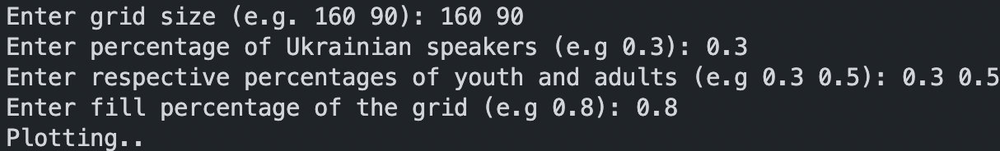

# Ukrainian Language Spread Simulation
Using the Ukrainian Language Spread Simulation, user can simulate the spread of Ukrainian speakers.

## Description

Module `person.py` represents a single person. The person has 5 possible states:
* ACTIVE_UA (active Ukrainian speaker),
* PASSIVE_UA (passive Ukrainian speaker),
* SURZHYK (speaking surzhyk: a mix between Russian and Ukrainian),
* PASSIVE_RU (passive Russian speaker),
* ACTIVE_RU (active Russian speaker);

which correspond to different stages of changing your main language and/or transitioning from Russian to Ukrainian.

Also, the person has 3 possible ages: YOUTH, ADULT, SENIOR; and as they grow older, they have the ability to change their age as well.

In main module (main.py), we created a simple UI in command line in order to give user the option to control the grid size, initial percentage of Ukrainian speakers, percentages of young people and adults, and the fill percentage of the grid.




In module `cellular_automation.py`, the grid is created in the form of NumPy array.

## Visualization

We used the matplotlib library to create helpful visualizations and animations.

## How to use

In order to run the simulation, clone the repository locally and run the `main.py` module:
```
git clone https://github.com/redn1nja/Discrete_Sim
cd Discrete_Sim
python3 main.py
```
